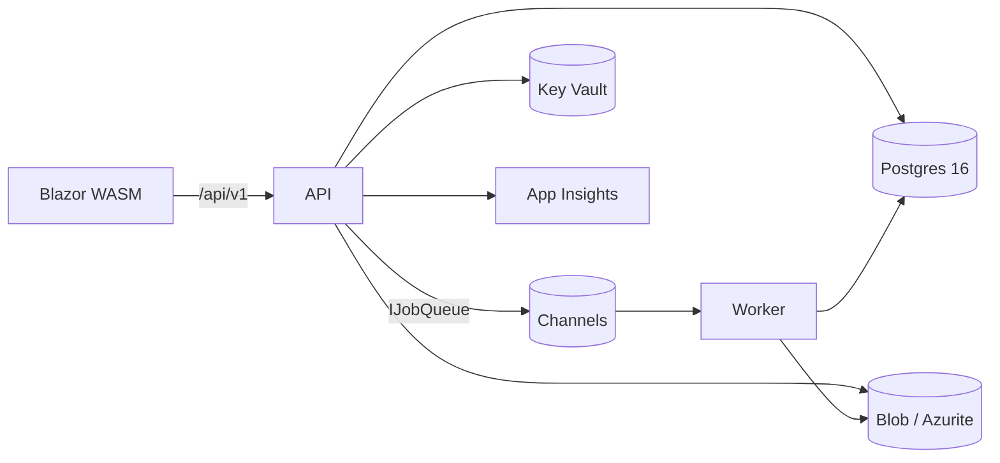

# KraftverkUptime

Modulær oppetidsanalyse-plattform for vannkraftverk.

- Første kunde: **Dalane-Kraft**
- Første anlegg: **Drivdal magasinkraftverk** (~2,2 MW)
- Denne releasen (v1): **plattformskjelett**. Domenelogikken (settlement-parser, KPI-er, klassifisering) leveres i Prompt 2.

## Arkitektur

Se `docs/architecture.md` for fulle C4-diagrammer (Context, Container, Component) og dataflyt.



Detaljer:

- `.NET 10` med ASP.NET Core Minimal API (Api), Worker (HostedService), Blazor WebAssembly (Web).
- `PostgreSQL 16` (Flexible Server i Azure, `postgres:16-alpine` lokalt). Én transaksjonsdatabase i v1; ADX forberedes additivt.
- `Azure Container Apps` kjører Api, Worker, Web. `Azure Key Vault` + Managed Identity for hemmeligheter.
- `OpenTelemetry` → Application Insights. Baggage: `ownerOrgId`, `plantId`, `userId`, `correlationId`.
- Retrofit-sømmer: `IJobQueue` (Channels), `IFileStorage` (local/Blob), `IDistributedCache` (memory), `IEventPublisher` (egen in-proc dispatcher), `ICurrentUser` (SystemUserContext), `IAuditLogger` (DB).

## Prosjektstruktur

```
.
├── src/
│   ├── KraftverkUptime.Core/                   # Kontrakter + domenetyper
│   ├── KraftverkUptime.Infrastructure/         # EF Core + default-seams + OTel + KeyVault
│   ├── KraftverkUptime.Api/                    # Minimal API, /api/v1 og /health
│   ├── KraftverkUptime.Web/                    # Blazor WASM frontend
│   ├── KraftverkUptime.Worker/                 # HostedService som kjører IJobHandler
│   ├── KraftverkUptime.Modules.Settlement/     # Placeholder – Prompt 2
│   ├── KraftverkUptime.Modules.Classification/ # Placeholder – Prompt 2
│   └── KraftverkUptime.Modules.Reporting/      # Placeholder – Prompt 2
├── tests/
│   ├── KraftverkUptime.Core.Tests/
│   └── KraftverkUptime.Infrastructure.Tests/
├── infra/                                      # Bicep (azd-kompatibelt)
├── .github/workflows/                          # CI og deploy (OIDC)
├── docs/architecture.md                        # Fullstendige C4-diagrammer
├── docker-compose.yml
├── azure.yaml                                  # azd-konfig
├── global.json                                 # Låser SDK til .NET 10
├── Directory.Build.props                       # Delte MSBuild-egenskaper
└── KraftverkUptime.sln
```

## Kjør lokalt

### Forutsetninger
- Docker Desktop (eller Podman/OrbStack)
- .NET 10 SDK (se `global.json`)
- `dotnet-ef` CLI: `dotnet tool install --global dotnet-ef`

### Første gang

```sh
cp .env.example .env

# Generer initial EF Core-migrering (kun første gang)
dotnet ef migrations add Initial \
    --project src/KraftverkUptime.Infrastructure \
    --startup-project src/KraftverkUptime.Api \
    --output-dir Persistence/Migrations
```

Uten denne vil `DatabaseBootstrapper` fortsatt starte — den faller tilbake til `EnsureCreated` og logger en advarsel.

### Start alt

```sh
docker compose up --build
```

Ressurser etter oppstart:

- API: http://localhost:5080/swagger
- Helse: http://localhost:5080/health/live og http://localhost:5080/health/ready
- Blazor WASM: http://localhost:5180
- Postgres: localhost:5432 (user/pass fra `.env`)
- Azurite Blob: http://localhost:10000

### Kjør tester

```sh
dotnet test KraftverkUptime.sln
```

## Kjør i Azure

Preflight:

```sh
azd auth login
azd env new kraftverkuptime-prod
azd env set AZURE_LOCATION norwayeast
azd env set POSTGRES_ADMIN_PASSWORD "$(openssl rand -base64 24)"
```

Provisjoner og deploy:

```sh
azd up
```

Etterpå: legg inn hemmeligheter i Key Vault (connection strings for eksterne systemer i Prompt 2), og sett `KEYVAULT_URL` som environment variable i Container App for Api og Worker.

## Legge til ny domenemodul (under 30 min)

1. **Opprett prosjekt** `src/KraftverkUptime.Modules.<Name>/KraftverkUptime.Modules.<Name>.csproj` med kun referanse til `KraftverkUptime.Core`.
2. **Implementer `IPlatformModule`** — én klasse som registrerer modulens tjenester via DI.
3. **Referer fra Api og Worker** i deres `.csproj`, og legg til ett linje i `Program.cs`:
   ```csharp
   builder.Services.AddPlatformModules(
       new Modules.MyNew.MyNewModule());
   ```
4. **Legg til tester** i `tests/KraftverkUptime.Modules.<Name>.Tests/`.
5. Moduler har eget DB-skjema hvis de persisterer data: lag egen `DbContext` eller bruk `KraftverkDbContext` med `modelBuilder.HasDefaultSchema("<name>")` for modulens entiteter. Kjør `dotnet ef migrations add <Name>_Initial` mot det modulprosjektet.

**Regel**: En PR som legger til eller oppgraderer én modul skal kun berøre modulens mappe pluss én linje i `Program.cs`.

## Sikkerhet

- Ingen hemmeligheter i kode, config eller logger. Bruk Key Vault via `KEYVAULT_URL`.
- Managed Identity i Azure (`DefaultAzureCredential` overalt). Lokalt faller den tilbake til `az login`.
- TLS 1.2+ kreves av Postgres og Storage.
- Policy-basert autorisasjon på alle endepunkter fra dag én.
- Secret scanning (Gitleaks) og SBOM (CycloneDX) i CI.

## Observability

- Traces, metrics og logs via OpenTelemetry til Application Insights.
- Helsekontroller: `/health/live` (prosess) og `/health/ready` (DB-tilkobling, m.m.).
- Korrelasjons-ID settes i `W3C TraceContext` og propageres til worker via `IJobQueue`.

## Feilsøking

| Symptom | Årsak | Løsning |
| --- | --- | --- |
| `docker compose up` henger på "postgres starting" | Postgres-helsesjekk venter på `pg_isready`. | Gi det opptil 30s på første start. Hvis den aldri blir healthy: `docker compose logs postgres`. |
| API returnerer 500 med melding om "pending migrations" | Første migrering mangler. | Kjør `dotnet ef migrations add Initial ...` (se over), rebuild image. |
| Worker krasjer med "No IJobHandler<X> registered" | Jobben er køet, men ingen handler i DI. | Registrer `services.AddScoped<IJobHandler<X>, XHandler>()` i aktuell modul. |
| Swagger viser ingen endepunkter | Endepunktgruppe mangler `.WithApiVersionSet(...)`. | Se `Endpoints/PlantsEndpoints.cs` som mal. |
| Lokalt faller Key Vault-oppslag tilbake til feil | `az login` er ikke kjørt. | Kjør `az login`, eller sett `KEYVAULT_URL` tomt i dev. |

## Fallgruver bygget inn i plattformen

1. UTC internt, Europe/Oslo ved I/O. DST-overganger testes i `TimeZonesTests`.
2. Key Vault-throttling forebygd via `ReloadInterval = 15 min`.
3. Managed Identity fungerer ikke lokalt → `DefaultAzureCredential` med CLI-fallback.
4. Event Hub-partisjonering utsatt til v2 – `IEventPublisher`-fasaden skjuler valget.
5. Global EF query filter påføres per entitet automatisk i `ModelBuilderExtensions.ApplyOwnedEntityFilters`.
6. `AssetEvent.Value` er `object?` i domenet, splittes til `value_numeric`/`value_json` i DB-mapping.
7. Soft delete + global filter: bruk `IgnoreQueryFilters()` eksplisitt når du vil se slettede rader.

## Akseptansekriterier for v1

- [x] Ny modul plugges inn ved å implementere `IPlatformModule` + én linje i Program.cs
- [x] Ingen hemmeligheter i kode/config/logger
- [x] Alle Azure-ressurser bruker Managed Identity
- [x] Tester kjører grønt på Core og Infrastructure
- [x] `docker compose up` starter alt lokalt
- [x] `azd up` provisjonerer og deployer til Azure
- [x] Oppgradering `SystemUserContext` → `EntraIdUserContext` = én linje i Program.cs

## Neste steg

**Prompt 2** implementerer domenelogikken i de tre modul-prosjektene:
- `KraftverkUptime.Modules.Settlement` – `ISettlementDataSource`-implementasjon for Drivdal-filformat
- `KraftverkUptime.Modules.Classification` – IEEE 762-klassifisering og KPI-beregning (IEEE-AF, leveringsgrad, FOR, EAF, ubalanse, BidDelivery)
- `KraftverkUptime.Modules.Reporting` – rapportbygger + XLSX-renderer

Fasit ligger i `drivdal-feb2025-fasit.json` og skal matches av regresjonstester.
