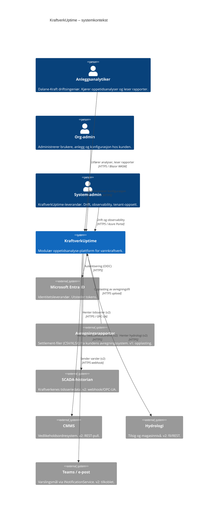
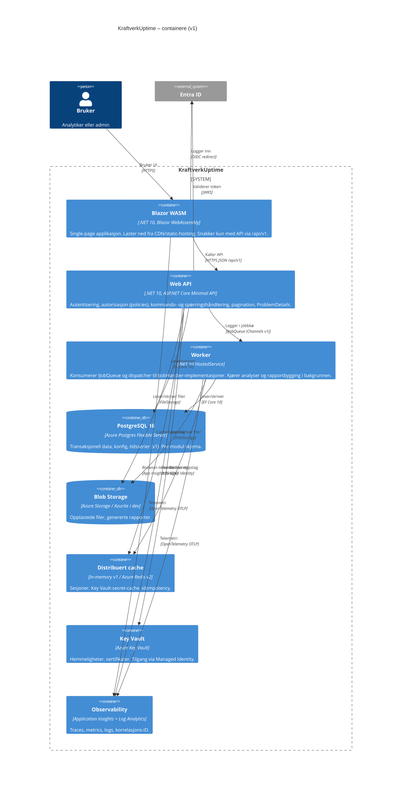
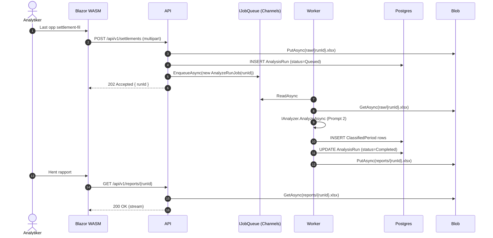

# KraftverkUptime – Arkitektur

Sist oppdatert: 2026-04-20. Versjon: v1 plattformskjelett.

## C4 Context



## C4 Container



## C4 Component – Api (utsnitt)

```mermaid
C4Component
    title API – interne komponenter
    Container_Boundary(api, "KraftverkUptime.Api") {
        Component(endpoints, "Endpoint groups", "Minimal API", "/api/v1/plants, /api/v1/reports, /health/*.")
        Component(policies, "Autorisasjonspolicies", "PlantReader, PlantAnalyst, PlantAdmin, OrgAdmin, SystemAdmin")
        Component(versioning, "API-versjonering", "Asp.Versioning.Http")
        Component(pagination, "Paginering", "Middleware + envelope { items, nextCursor, pageSize }")
        Component(errors, "Feilhåndtering", "ProblemDetails, exception mapper")
        Component(otel, "Telemetri", "OpenTelemetry middleware, baggage: orgId/plantId/userId/correlationId")

        Component(dispatcher, "In-proc dispatcher", "IEventPublisher + egen kode (~50 linjer)", "Publiserer IDomainEvent til registrerte handlere. Erstatter MediatR.")
    }

    Container_Boundary(core, "KraftverkUptime.Core") {
        Component(contracts, "Kontrakter", "IDataSource, IAnalyzer, IReportBuilder, IJobQueue, IJobHandler, IFileStorage, IEventPublisher, IAuditLogger, ICurrentUser, IQueryContext, IPlantConfiguration, INotificationService")
        Component(domain, "Domenetyper", "AssetEvent, ClassifiedPeriod, DataQualityState, UnitState, PlantType, IOwnedEntity, IDomainEvent")
    }

    Container_Boundary(infra, "KraftverkUptime.Infrastructure") {
        Component(efcore, "EF Core", "DbContext med global query filter via IQueryContext, soft-delete filter")
        Component(seams, "Retrofit-defaults", "ChannelsJobQueue, LocalFileStorage/BlobFileStorage, MemoryPlantConfiguration+DB, MemoryCache, LogNotificationService, AuditLogger")
        Component(identity, "Identitet", "SystemUserContext (v1) / EntraIdUserContext (v2)")
    }

    Container_Boundary(modules, "Moduler (placeholder i v1)") {
        Component(modSettlement, "Settlement-modul", "Implementerer ISettlementDataSource i Prompt 2")
        Component(modClass, "Klassifisering", "IAnalyzer<Events, ClassifiedPeriods>")
        Component(modReport, "Rapport", "IReportBuilder, IReportRenderer")
    }

    Rel(endpoints, policies, "Beskyttes av")
    Rel(endpoints, versioning, "Rutes via")
    Rel(endpoints, pagination, "Responderer via")
    Rel(endpoints, errors, "Feil oversettes i")
    Rel(endpoints, otel, "Instrumenteres av")

    Rel(endpoints, contracts, "Kaller kontrakter fra")
    Rel(endpoints, modules, "Eksekverer via DI")
    Rel(modules, contracts, "Implementerer")
    Rel(modules, domain, "Bruker")
    Rel(efcore, contracts, "Implementerer IQueryContext og repositories via")
    Rel(seams, contracts, "Implementerer")
    Rel(identity, contracts, "Implementerer ICurrentUser")
    Rel(dispatcher, contracts, "Implementerer IEventPublisher")
```

## Dataflyt – analysejobb (v1)



## Modulgrensediagram

```mermaid
flowchart LR
    subgraph Core[KraftverkUptime.Core]
        direction TB
        contracts[Kontrakter]
        domain[Domenetyper]
        events[IDomainEvent-ark]
    end

    subgraph Infra[KraftverkUptime.Infrastructure]
        direction TB
        efcore[EF Core DbContext]
        seams[Defaults: Channels, LocalFile/Blob, Memory, LogNotif, AuditLog]
        dispatch[InProcEventPublisher]
        identity[SystemUserContext]
    end

    subgraph Api[KraftverkUptime.Api]
        direction TB
        endpoints[Minimal API endpoints]
        policies[Policies]
        health[/health/live /health/ready]
    end

    subgraph Worker[KraftverkUptime.Worker]
        jobloop[JobLoopService]
    end

    subgraph Web[KraftverkUptime.Web]
        blazor[Blazor WASM shell]
    end

    subgraph Modules[Moduler Prompt 2]
        direction TB
        mSettlement[Settlement]
        mClass[Klassifisering]
        mReport[Rapport]
    end

    Api --> Core
    Infra --> Core
    Worker --> Core
    Web --> Core
    Modules --> Core
    Api --> Infra
    Worker --> Infra
    Api --> Modules
    Worker --> Modules
    Web --> Api
```

## Legende for additive valg

```mermaid
flowchart TB
    subgraph v1[v1 – levert nå]
        direction LR
        a1[Channels IJobQueue]
        a2[Local/Blob IFileStorage]
        a3[Memory IDistributedCache]
        a4[In-proc IEventPublisher]
        a5[SystemUserContext]
        a6[Postgres alle data]
    end

    subgraph v2[v2 – additivt senere]
        direction LR
        b1[Service Bus IJobQueue]
        b2[Azure Blob kun]
        b3[Azure Redis]
        b4[Event Hub fan-out]
        b5[EntraIdUserContext]
        b6[ADX for tidsserie]
    end

    a1 -. tillegg .-> b1
    a2 -. samme interface .-> b2
    a3 -. tillegg .-> b3
    a4 -. tillegg .-> b4
    a5 -. én linje i Program.cs .-> b5
    a6 -. tillegg, Postgres beholder transaksjonell .-> b6
```

## Fallgruver som er bygget inn i plattformen

1. **UTC internt, Europe/Oslo ved I/O.** `DateTimeOffset` overalt, konverteres kun i rendering-laget. DST-sjekker i tester (mars/oktober).
2. **Key Vault-throttling.** `IConfiguration`-provider cacher secrets i 15 min; `DefaultAzureCredential` med CLI-fallback for lokal dev.
3. **Managed Identity fungerer ikke lokalt.** Lokalt brukes brukerens Azure CLI-pålogging gjennom `DefaultAzureCredential`; ingen connection strings med passord i repo.
4. **Global query filter i EF Core må aktiveres per entitet.** Gjøres i `ModelBuilderExtensions.ApplyOwnedEntityFilters`, som kalles i `OnModelCreating`. Nye entiteter som arver `OwnedEntity` får filter automatisk.
5. **Event Hub partisjonering er vanskelig å endre.** Ingen partisjonering valgt i v1. `IEventPublisher`-fasaden skjuler dette; partisjonsvalg tas når Event Hub kobles til.
6. **`AssetEvent.Value` som `object?` er EF-uvennlig.** Domene-record-en forblir som spesifisert, men lagres i Postgres som to kolonner (`value_numeric double precision null`, `value_json jsonb null`). Mapping skjer i Infrastructure.
7. **Soft-delete + global filter + `Include()`.** Include respekterer ikke alltid filter – bruk `IgnoreQueryFilters()` eksplisitt ved behov, aldri implisitt.
